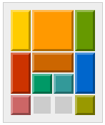
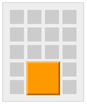
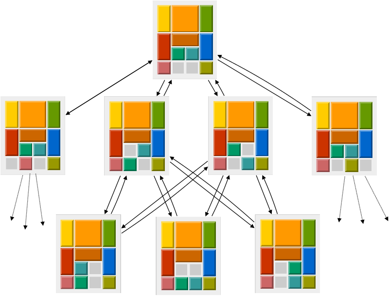

# A SOLVER FOR KLOTSKI (210 points possible)
Klotski is a sliding block puzzle, that has a fairly detailed [page on WikiPedia](https://en.wikipedia.org/wiki/Klotski).
The purpose of this project is to write a solver for Klotski using a graph exploration algorithm.

The Klotski puzzle is made of a board of 4x5 places which contains the following 10 pieces:

* one 2x2 square piece (written `S`) ;
* one 2x1 horizontal rectangle piece (written `H`) ;
* four 1x2 vertical rectangle pieces (written `V0`, `V1`, `V2` and `V3`) ;
* four 1x1 square pieces (written `C0`, `C1`, `C2`, `C3`).

The puzzle is presented in the initial configuration that is shown in the following picture:



A move in this puzzle consists in sliding a piece at a time, and to win you must have managed to move the large square piece all the way down, reaching a configuration that matches the following shape pattern:



To solve the puzzle, one may search all its state space for a winning configuration.
The state space of the Klotski puzzle can be described as a graph, having as nodes the configurations of the board, and as arrows the possible moves.

In the following picture, we show an excerpt of the Klotski graph, starting from the initial configuration.
All the boards reachable from the initial configuration in one step are shown, as well as a few of the boards reachable in two steps.



Since all moves can be undone, it is easy to see that one can move from any configuration of the graph to any other configuration of the graph.
This means that, when exploring the graph, one will naturally pass through the same configuration more than once, following different paths.
To avoid spending our time running in circles when searching for a solution, we will need to avoid visiting a configuration more than once!

## APPROACH
To solve the Klotski puzzle, you will proceed in two steps:

* A: As a first step, you will write a _generic solver_ for any problem whose search space can be represented by a graph, and making sure you handle properly loops in the graph.

* B: As a second step, you will describe the Klotski puzzle search space as a graph.

Once the two steps above are done, finding a solution will just be a matter of passing the Klotski graph to the generic solver.

**Note:** this project may take quite a lot of time to be graded, because it is long, and because the algorithm is complex.
We suggest that you use the typecheck button and the toplevel extensively, so that you are reasonnably sure of your code before submitting it to the tests.
Also, we added a function `grade_only : int list -> unit`, that you may call in your code to select the exercises to grade.
All other exercises won't be graded at all, and considered failed. For instance, if you write `grade_only [ 3 ] ;;` at the beginning of your file, only exercise 3 will be tested.

## PRELIMINARIES
First, you will implement some useful basic functions.

1. Write a function `loop` of type `('a -> bool) -> ('a -> 'a) -> 'a -> 'a` such that `loop p f x = x` when `p x = true` and `loop p f x = loop p f (f x)` otherwise.

2. Write a function `exists` of type `('a -> bool) -> 'a list -> bool` such that `exists p l = true` if and only if there exists an element `x` of `l` such that `p x = true`.

3. Write a function `find` of type `('a -> bool) -> 'a list -> 'a` such that `find p l = x` if `x` is the first element of `l` for which `p x = true`.
If no such element exists, find raises the exception `NotFound` given in the prelude.

## PART A: A GENERIC PROBLEM SOLVER
The goal of this section is to implement a generic problem solver based on graph exploration.
The questions will help you start with a naive implementation and refine it step-by-step.

A general way to look at problem solving is to consider some set **&IEcy;** representing the states of the problem and to consider also a finite binary relation &realine; that represents the small reasoning steps that can be made to move from one state of the problem to another.

Remember that a binary relation is a subset of all the pairs in **&IEcy;**.
We will write **_x_**&realine;**_y_** if (**_x_**, **_y_**) is in &realine;.
The image of **_x_** under &realine; in **&IEcy;** is written &realine;(**_x_**) and it is defined as the set of all **_y_** in **&IEcy;** such that **_x_**&realine;**_y_**.
A relation can be viewed through this image function as a function from **&IEcy;** to the subsets of **&IEcy;**.
Hence, we can use the following type definition (also given in the prelude) to represent binary relations.

```ocaml
type 'e rel = 'e -> 'e list
```

4. As an exercise, we want to define a relation **_x_**&Nscr; **_y_** that tells if the difference between two integers is at most 2.
For instance, we have that 1&Nscr; 3, 3&Nscr; 1 and 2&Nscr; 2, but not 1&Nscr; 4 or 5&Nscr; 0.
Define `near: int rel` that encodes the image of this relation as an OCaml function.
For instance, `near 2` should return something like `[0;1;2;3;4]`.

In practice, the `'e rel` type describes the function which, from a given configuration of the problem, gives all the possible configurations in which we can end up after performing a step.
In this question, we want not just to look at the possible next steps from a single configuration, but from a set of configurations.

Formally, we will say that we extend the image function &realine; of a binary relation &realine; over **&IEcy;** to a function &bnot;&realine; defined as follows.

&bnot;&realine;([ ]) = [ ]

&bnot;&realine;(**_x_** :: **_xs_**) = &realine;(**_x_**) @ &bnot;&realine;(**_xs_**).

Basically, this computes the list of all possible new configuration that are reachable in one step from any configuration in an original list, losing track of the exact predecessor of each configuration.
We just know that if a configuration is present in the resulting set, then there must have been one in the original set that led to it in one step.

5. Write a function `flat_map` of type `'e rel -> ('e list -> 'e list)` such that `flat_map r` represents &bnot;&realine; if `r` represents a binary relation &realine;.
For instance, `flat_map near` applied to `[2;3;4]` should return something like `[0;1;2;3;4;1;2;3;4;5;2;3;4;5;6]`.

A binary relation over the set of problem configurations relates all pairs of configurations that are separated by a single step (for us, moving one piece of the game).
Sometimes, we want to relate a configuration with its possible futures, up to a given number of steps.
Formally, if &realine; is a binary relation over **&IEcy;**, we say that **_x_**&realine;<sup>n</sup>**_y_** iff there exists a chain of elements **_e_**<sub>i</sub> of **&IEcy;** of length **_n−1_** such as **_x_**&realine;**_e_**<sub>1</sub>&realine;...&realine;**_e_**<sub>n-1</sub>&realine;**_y_**.
The image function of &realine;<sup>n</sup> is simply the image function of &realine; iterated **_n_** times.

6. Write a function `iter_rel: 'e rel -> int -> 'e rel` that computes this iteration.
Iterating a relation 1 time or less does nothing (identity).
For instance, `iter_rel near 2` should be the image function of the relation that tells is two integers are separated by 4 of less.

The transitive closure of a binary relation &realine; is the relation that iterates &realine; over and over.
Therefore, this is the union of all the relations obtained by iterating **_n_** times the relation &realine;, for all **_n_**.

Formally, &realine;(**_x_**) = &realine;<sup>0</sup>(**_x_**) ∪ &realine;<sup>1</sup>(**_x_**) ∪ &realine;<sup>2</sup>(**_x_**) ∪ ...

Or more constructively, &realine;<sup>0</sup>(**_x_**) = [**_x_**] and &realine;<sup>n+1</sup>(**_x_**) = &bnot;&realine;(&realine;<sup>n</sup>(**_x_**)).

We are not interested in computing the transitive closure of any relation, which could not terminate, depending on the relation.
Our purpose is to compute the possible futures, starting from the initial configuration of the problem, until a specific property of the state is reached (in our case, we won the game).

To represent such a property, we use the following type (also given in the prelude).
It is a function that takes a state, and tells if the property holds (returning `true`) or not.

```ocaml
type 'e prop = 'e -> bool
```

Solving a problem characterized by a property **_p_** and a relation &realine; for an initial problem state **_s_** is finding an element **_x_** in &realine;(**_s_**) such that **_p_**(**_x_**) = `true`.

7. Write a function `solve` of type `'a rel -> 'a prop -> 'a -> 'a` such that `solve r p x` computes the iteration of the relation &realine; represented by `r` starting at `x` until it reaches an element `y` such that `p y`.
For instance, `solve near (fun x -> x = 12) 0` should simply return `12`.
Internally, the function will start from the set `[0]`, and iterate near to obtain first `[-2;-1;0;1;2]`, then a sequence of growing lists, until eventually one iteration returns a list that contains `12`.

8. Define a function `solve_path` of type `'a rel -> 'a prop -> 'a -> 'a list` such that `solve_path r p x` behaves exactly as solve except that it produces not only the final value y such that p y but also all the intermediate elements from `x` to `y` that show how `x` is related to `y` through `r`.
For instance, `solve_path near (fun x -> x = 12) 0` should return `[0;2;4;6;8;10;12]`.
This function can be written simply by calling `solve` with well-chosen arguments.
The idea is to iterate over the set of paths to destinations, instead of the set of destinations.

The previous solver is very naive since it introduces a lot of redundancy in the search process.
This is due to the simplistic representation of sets as lists: an element may be repeated several times in a list.
Let us assume that we are given a more efficient data structure for sets over elements of type `'a` as specified by the following record type `('a, 'set) set_operations` (also given in the prelude).

```ocaml
type ('a, 'set) set_operations =
  { empty : 'set ;
    mem : 'a -> 'set -> bool ;
    add : 'a -> 'set -> 'set }
```

This is a pattern that you will see in some OCaml libraries, to combine a set of operations in something more syntactically lightweight than an object or a functor.
It is simple to use: given that you have a value `ops` of this type, just use `ops.empty` to obtain an empty set, `ops.add 13 s` to create a new set that is a copy of an existing set `s` augmented with a new element `13`, `s.add 1 (s.add 2 s.empty)` to create a set from scratch containing two elements `1` and `2`, and finally `s.mem 8 s` to test if `8` is an element of a set `s`.

From now on, we will assume that a value of type `('a, 'set) set_operations` will be provided as input to the solver (you won't have to write one).
For your own tests, you can use `int_set_operations: (int, _) set_operations` and `int_list_set_operations: (int list, _) set_operations` that are predefined.

9. Write a function `archive_map` of type `('a, 'set) set_operations -> 'a rel -> ('set * 'a list) -> ('set * 'a list)`
such that: `archive_map opset rel (s, l) = (s', l')`, where:
* `l'` is the list of elements that are reachable using `rel` from the elements of `l` and which are not already in the set `s`.
* `s'` is the union of `s` and the elements of `l'`.

10. Use `archive_map` to program a new function `solve'` (don't forget the quote after the name) of type `('a, 'set) set_operations -> 'a rel -> 'a prop -> 'a -> 'a` that explores the search space with no redundancy.

11. Same question for `solve_path'` of type `('a list, 'set) set_operations -> 'a rel -> 'a prop -> 'a -> 'a list`.

The last step of this first part is to implement a solver for a one-player puzzle.
A one-player puzzle is characterized by the following elements.

* a type for `'configuration`s which represent the states of the puzzle ;
* a type for `'move`s which represent how the player can move from one configuration to another ;
* a function `move : 'configuration -> 'move -> 'configuration` which applies a move to a configuration to get a new one ;
* a function `possible_moves : 'configuration -> 'move list` which returns the list of moves that can be applied to an input configuration ;
* a function `final : 'configuration -> bool` which returns true if and only if the input configuration is the one we are looking for.

The following record type `puzzle` (also given in the prelude) will be used to characterize a puzzle.
```ocaml
type ('configuration, 'move) puzzle =
  { move : 'configuration -> 'move -> 'configuration;
    possible_moves : 'configuration -> 'move list;
    final : 'configuration -> bool }
```

12. Implement `solve_puzzle : ('c, 'm) puzzle -> ('c list, 's) set_operations -> 'c -> 'c list` such that `solve_puzzle p opset c` is a list of moves the application of which to the configuration `c` results in a configuration `c'` such that `p.final c' = true`.
Here, opset is a record of set operations which the implementation of `solve_puzzle` may use.


## PART B: A SOLVER FOR KLOTSKI

Let's start by giving names to the pieces on the board:
* the one 2x2 square piece are written `S` ;
* the one 2x1 horizontal rectangle piece are written `H` ;
* the four 1x2 vertical rectangle pieces are written `V0`, `V1`, `V2` and `V3` ;
* the four 1x1 square pieces are written `C0`, `C1`, `C2`, `C3`.

As you have surely noticed, the board has two places which are not covered by any piece.
We will write `X` to denote such a place.

The type to describe the different kind of pieces is naturally an enumeration:

```ocaml
type piece_kind = S | H | V | C | X
```

A piece is characterized by its kind and an index.

```ocaml
type piece = piece_kind * int
```

Let us enumerate the pieces using toplevel definitions:

```ocaml
let x = (X, 0) and s = (S, 0) and h = (H, 0)
let (c0, c1, c2, c3) = ((C, 0), (C, 1), (C, 2), (C, 3))
let (v0, v1, v2, v3) = ((V, 0), (V, 1), (V, 2), (V, 3))
let all_pieces : piece list = [ s; h; c0; c1; c2; c3; v0; v1; v2; v3 ]
```

A board is a matrix of 5x4 places.
Each place refers to the piece that covers it.

```ocaml
type board = piece array array
```

You can use the function `display_board: board -> unit` to visualize a board configuration in the toplevel.

For instance, the initial configuration is written as follows:


```ocaml
[| [| (V,0) ; (S,0) ; (S,0) ; (V,1) |] ;
   [| (V,0) ; (S,0) ; (S,0) ; (V,1) |] ;
   [| (V,2) ; (H,0) ; (H,0) ; (V,3) |] ;
   [| (V,2) ; (C,0) ; (C,1) ; (V,3) |] ;
   [| (C,2) ; (X,0) ; (X,0) ; (C,3) |] |]
```

13. Write a function `final: board -> bool` such that `final board = true` if and only if `board` is a final configuration for Klotski.

We have defined the configurations of our puzzle, now we have to define the moves.
We will use the following types (also given in the prelude).

```ocaml
type move = Move of piece * direction * board
and direction = { dcol : int; drow : int }
```

A move is characterized by a direction and a piece it is applied to.
The third component is the board that is obtained when this move is applied to the current board.

With this definition of a move, applying a move to a board is very simple: we just extract the image board from it.

```ocaml
let move _ (Move (_, _, b)) = b
```

14. Write a function `move_piece : board -> piece -> direction -> board option` such that `move_piece board p { drow; dcol } = Some board'` if moving the piece `p` in `board` in direction `{ drow; dcol }` is possible and gives `board'`.
Otherwise, if this move is not possible, `move_piece` returns `None`.

15. Define `possible_moves : board -> move list` that returns a list of moves that can be applied to board.

At this point, you can define the puzzle instance to pass to the generic solver.

```ocaml
let klotski : (board, move) puzzle = { move; possible_moves; final }
```

16. The solver also expects a data structure to represent sets of boards.
Use the standard library's functor `Set.Make` to implement this data structure as a module `BoardSet` of signature `Set.S with type elt = board`.
The required comparison function `compare : board -> board -> int` should be such that `compare b1 b2 = 0` if all cells of both arrays are exactly the same.
Otherwise, it should compare the cells of the two arrays pairwise, starting from cell `.(0).(0)`, then `.(0).(1)`, `.(0).(2)`, `.(0).(3)`, `.(1).(0)`, etc.
up to the last cell `.(4).(3)`.
The function should return the result of the first comparison of cells that does not return `0`.
To compare to cells at index `.(i).(j)`, the first component (the kind of piece) is compared.
The result is `< 0` if `b1.(i).(j) < b2.(i).(j)` and `> 0` if `b1.(i).(j) > b2.(i).(j)`.
For this the pieces are ordered as follows: `S > H > C > V > X`.
If both first components are the same, the result is the comparison of the second component, with the usual order on integers.

17. Update your `compare` function, so that it performs as few array accesses as possible, respecting the previous ordering algorithm.
It must read the arrays up to the first pair of cells that differ.
It should only read the entire arrays in case of equality.
**Hint:** If you used loops, you can use an exception.
**Note:** All array accesses are counted, so `a.(y).(x)` counts for two.
If you read several cells in a same row, better put the row in a variable!


## PUTTING IT ALL TOGETHER

Write a function `solve_klotski : board -> board list` such that `solve_klotski initial_board` is a list of boards from the `initial_board` to a `board` such that `final board = true`.
This list must come from a sequence of valid moves of this puzzle.

You can use the function `display_solution: board list -> unit` to visualize a solution in the toplevel.
The two values `initial_board_trivial` and `initial_board_simpler` are variants of the initial configuration whose resolution should be much faster.


### THE GIVEN PRELUDE
```ocaml
exception NotFound

type 'e rel = 'e -> 'e list
type 'e prop = 'e -> bool

type ('a, 'set) set_operations = {
  empty : 'set;              (* The empty set. *)
  mem : 'a -> 'set -> bool;  (* [mem x s = true] iff [x] is in [s]. *)
  add : 'a -> 'set -> 'set;  (* [add s x] is the set [s] union {x}. *)
}

type ('configuration, 'move) puzzle = {
  move : 'configuration -> 'move -> 'configuration;
  possible_moves : 'configuration -> 'move list;
  final : 'configuration -> bool
}

type piece_kind = S | H | V | C | X
type piece = piece_kind * int
let x = (X, 0) and s = (S, 0) and h = (H, 0)
let (c0, c1, c2, c3) = ((C, 0), (C, 1), (C, 2), (C, 3))
let (v0, v1, v2, v3) = ((V, 0), (V, 1), (V, 2), (V, 3))
let all_pieces : piece list = [ s; h; c0; c1; c2; c3; v0; v1; v2; v3 ]

type board = piece array array
let initial_board =
  [| [| v0 ; s  ; s  ; v1 |];
     [| v0 ; s  ; s  ; v1 |];
     [| v2 ; h  ; h  ; v3 |];
     [| v2 ; c0 ; c1 ; v3 |];
     [| c2 ; x  ; x  ; c3 |] |]

let initial_board_simpler =
  [| [| c2 ; s  ; s  ; c1 |] ;
     [| c0 ; s  ; s  ; c3 |] ;
     [| v1 ; v2 ; v3 ; v0 |] ;
     [| v1 ; v2 ; v3 ; v0 |] ;
     [| x  ; x  ; x  ; x  |] |]

let initial_board_trivial =
  [| [| x  ; s  ; s  ; x  |] ;
     [| x  ; s  ; s  ; x  |] ;
     [| x  ; x  ; x  ; x  |] ;
     [| x  ; x  ; x  ; x  |] ;
     [| x  ; x  ; x  ; x  |] |]

type direction = { dcol : int; drow : int; }
type move = Move of piece * direction * board
let move _ (Move (_, _, b)) = b
```

### YOUR OCAML ENVIRONMENT
```ocaml
let rec loop p f x =
  "Replace this string with your implementation." ;;

let rec exists p l =
  "Replace this string with your implementation." ;;

let rec find p l =
  "Replace this string with your implementation." ;;

(* --- Part A: A Generic Problem Solver --- *)

let near x =
  "Replace this string with your implementation." ;;

let rec flat_map r =
  "Replace this string with your implementation." ;;

let rec iter_rel rel n =
  "Replace this string with your implementation." ;;

let solve r p x =
  "Replace this string with your implementation." ;;

let solve_path r p x =
  "Replace this string with your implementation." ;;

let archive_map opset r (s, l) =
  "Replace this string with your implementation." ;;

let solve' opset r p x =
  "Replace this string with your implementation." ;;

let solve_path' opset r p x =
  "Replace this string with your implementation." ;;

let solve_puzzle p opset c =
  "Replace this string with your implementation." ;;

(* --- Part B: A Solver for Klotski --- *)

let final board =
  "Replace this string with your implementation." ;;

let move_piece board piece { drow; dcol } =
  "Replace this string with your implementation." ;;

let possible_moves board =
  "Replace this string with your implementation." ;;

module BoardSet = Set.Make (struct
    type t = board
    let compare b1 b2 =
      failwith "Replace this with your implementation." ;;
  end)

let solve_klotski initial_board =
  "Replace this string with your implementation." ;;
```